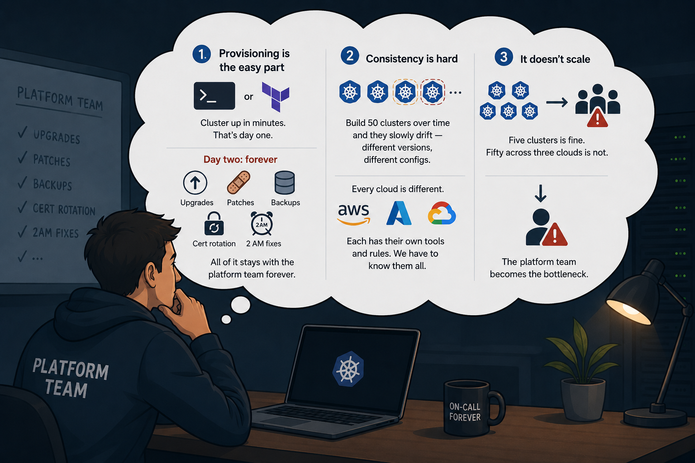
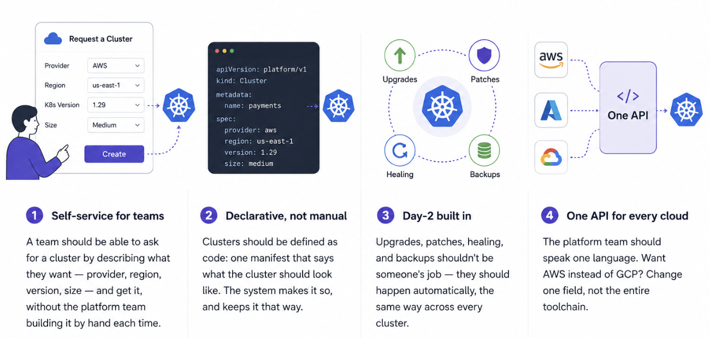
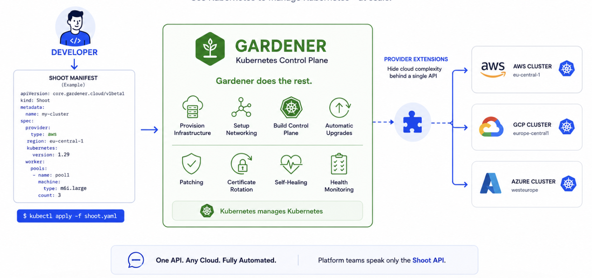
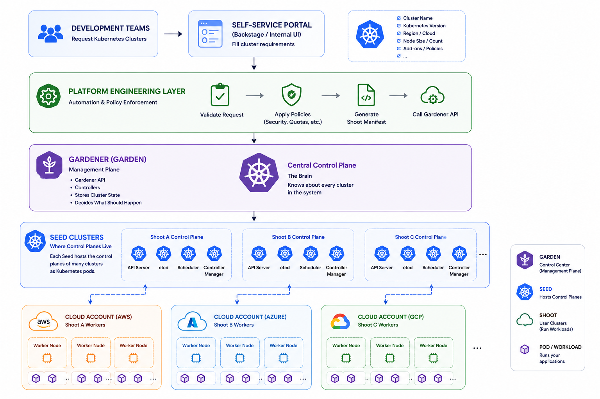

## Kubernetes Cluster Management at Scale with Gardener

- [1. The Scenario](#1-the-scenario)
  - [1.1 The Daily Conversation](#11-the-daily-conversation)
- [2. The Problem](#2-the-problem)
- [3. What We Actually Need?](#3-what-we-actually-need)
- [4. Gardener - Kubernetes as a Service - Across Any Cloud](#4-gardener---kubernetes-as-a-service---across-any-cloud)
- [5. Gardener Architecture: Garden, Seed, and Shoot](#5-gardener-architecture-garden-seed-and-shoot)
- [6. Hands-on: Running Gardener Locally](#6-hands-on-running-gardener-locally)


### 1. The Scenario


Let's assume we have a large software company, more than 5,000+ employees, multiple products, customers all over the world.

This company has 50+ development teams. Each team owns different projects, different microservices, and has different needs:

- Team A builds customer-facing APIs that handle millions of requests per day

- Team B works on internal data pipelines that process terabytes of information

- Team C maintains the company's e-commerce platform

- Team D is building a new AI/ML service

And so on, and so on...

Every single team needs one thing in common: **a place to run their containers.**

#### 1.1. The Daily Conversation


Now, here's a conversation that happens every single day, multiple times a day, in this company:


**Developer:** "Hey Platform Team, we're spinning up a new service and we need a Kubernetes cluster."

**Platform Team:** "Sure, what do you need?"

**Developer:** "Nothing fancy:

- 3 worker nodes

- 8GB RAM and 4 vCPU per node

- Needs to auto-scale

- We don't care if it's AWS, Azure, or GCP, just give us something that works

- Oh, and when can we have it?"

**Platform Team:** (sighs internally) "We'll get back to you."


This exact conversation plays out multiple times a day, every single day of the year. And it's not just about creating clusters, it's about keeping them healthy, updating them, scaling them, and making sure they don't break at 2 AM.

### 2. The Problem



Every team just wants one thing: a place to run their containers. So they ask the platform team for a Kubernetes cluster. Simple, but here's where it gets hard.

1. **Provisioning is the easy part**: Terraform or eksctl can spin up a cluster in minutes. That's day one. The real work is day two: upgrades, patches, backups, cert rotation, and 2 AM fixes, all of it stays with the platform team forever.

2. **Consistency is hard**: Build 50 clusters over time and they slowly drift — different versions, different configs. Keeping a whole fleet identical and healthy is a constant fight.
Every cloud is different. AWS, Azure, and GCP each have their own tools and rules. The platform team has to know them all.
3. **It doesn't scale**: Five clusters is fine. Fifty across three clouds is not. The platform team becomes the bottleneck.

In the end, teams wait, the platform team drowns, and clusters quietly turn into a risk instead of a tool.

### 3. What We Actually Need?

If we want to fix the problem mentioed above, we need a way of managing clusters that does four things:



### 4. Gardener - Kubernetes as a Service - Across Any Cloud    



- **Gardener** is an **open-source project** (originally built by SAP) that does exactly what we described: it manages Kubernetes clusters as a service, at scale, across any cloud.

- The core idea is simple: use Kubernetes to manage Kubernetes.

- You don't click buttons or run scripts to build a cluster. Instead, you write a **Shoot** manifest that describes the cluster you want: the provider, the region, the version, the worker pools. You apply it, and Gardener does the rest. 

- It provisions the machines, sets up networking, builds the control plane, and from then on keeps the cluster healthy: upgrades, patches, certificate rotation, self-healing, all automatic.

- If you want AWS instead of GCP, you change one field. The manifest stays the same; Gardener's provider extension handles the cloud-specific details behind the scenes. The platform team only speaks one language: **the Shoot API**.

So the four problems from before disappear:

1. Provisioning + Day-2: handled by Gardener, automatically, the same way every time.
2. Consistency: every cluster is built and maintained by the same controllers, so no drift.
3. Every cloud is different: one API, provider details hidden behind extensions.
4. It doesn't scale: Gardener is designed to run thousands of clusters, not five.

- The platform team stops being a bottleneck. They build the platform; teams help themselves.

But to understand how Gardener pulls this off, we need to look at its architecture and that starts with three words: **Garden**, **Seed**, and **Shoot**.

### 5. Gardener Architecture: Garden, Seed, and Shoot




- Gardener's design comes straight from its name. There are three kinds of clusters, and each plays a different role.

  - **Garden** - the control center.

      - This is the central cluster where Gardener itself runs. It's where you, the platform team, submit your Shoot manifests. The Garden cluster doesn't run anyone's workloads; it's the brain that knows about every cluster in the system and decides what needs to happen. Think of it as the place where you plant everything.

  - **Seed** — where the control planes live.

      - Here's Gardener's clever trick. Normally, every Kubernetes cluster needs its own control plane (API server, etcd, scheduler, etc.), usually running on dedicated master nodes. That's expensive and a pain to manage at scale. Instead, Gardener runs each cluster's control plane as pods inside a Seed cluster. So one Seed can host the control planes of many clusters at once — cheap, dense, and easy to operate. Seeds are the soil where clusters take root.

  - **Shoot** — the cluster teams actually use.

      - A Shoot is the end-user cluster — the one Team A runs their containers on. Its control plane lives as pods on a Seed, and its worker nodes run in the team's own cloud account (AWS, Azure, GCP...). To the team, it looks and behaves like a completely normal Kubernetes cluster. They never see the machinery underneath.

- So the flow is:
  - You apply a Shoot manifest to the Garden cluster
  - Gardener places that cluster's control plane on a Seed
  - the Shoot's worker nodes spin up in the target cloud
  - Gardener keeps it all healthy, forever.

This is why Gardener scales to thousands of clusters: control planes are just containers, managed like any other Kubernetes workload. No special master VMs, no snowflakes — Kubernetes managing Kubernetes, all the way down.

### 6. Hands-on: Running Gardener Locally

- Let's run Gardener on a laptop. We'll use a single **KinD** cluster that plays both the Garden and the Seed role, then create our first Shoot on top of it.

> **Why Linux?** Gardener's local setup is designed for Linux. On macOS it runs inside Docker Desktop's VM (gVisor networking + virtiofs), which adds networking and disk-I/O overhead that can stall worker-node provisioning. On a native Linux host these layers don't exist, so the setup is faster and far less error-prone. The steps below target **Ubuntu**.

- **Prerequisites**: An Ubuntu machine (20.04 or newer) with at least 8 CPUs / 8Gi memory (more if you want several Shoots) and ~120Gi free disk. The official docs don't pin an Ubuntu version, but they do require **up-to-date tooling** — in particular a recent **Docker Engine**, **kubectl ≥ v1.30**, and the **latest Go**. On Ubuntu 20.04 the default `apt` packages are too old, so install these from their official sources (see 1.1). Follow the Local Setup guide up to the Get the sources step (2*).

**1. Clone the repo and create the KinD cluster**


**1.1. Install prerequisites (Ubuntu):** Unlike macOS, Ubuntu already ships the GNU coreutils and the `ip` command that Gardener's scripts expect — no extra GNU tools or `PATH` tweaks are needed. You only need recent versions of Docker, kubectl and Go. On Ubuntu 20.04 the packages in the default `apt` repos are too old, so install them from their official sources:

```
   # --- Docker Engine (from Docker's official repo, not the old apt docker.io) ---
   sudo apt-get remove -y docker docker-engine docker.io containerd runc 2>/dev/null
   sudo apt-get update
   sudo apt-get install -y ca-certificates curl gnupg make git
   sudo install -m 0755 -d /etc/apt/keyrings
   curl -fsSL https://download.docker.com/linux/ubuntu/gpg | sudo gpg --dearmor -o /etc/apt/keyrings/docker.gpg
   sudo chmod a+r /etc/apt/keyrings/docker.gpg
   echo "deb [arch=$(dpkg --print-architecture) signed-by=/etc/apt/keyrings/docker.gpg] https://download.docker.com/linux/ubuntu $(. /etc/os-release && echo $VERSION_CODENAME) stable" | sudo tee /etc/apt/sources.list.d/docker.list > /dev/null
   sudo apt-get update
   sudo apt-get install -y docker-ce docker-ce-cli containerd.io
   sudo usermod -aG docker $USER && newgrp docker   # run docker without sudo

   # --- kubectl (>= v1.30) ---
   curl -LO "https://dl.k8s.io/release/$(curl -L -s https://dl.k8s.io/release/stable.txt)/bin/linux/amd64/kubectl"
   sudo install -o root -g root -m 0755 kubectl /usr/local/bin/kubectl

   # --- Go (latest) ---
   # download the current release from https://go.dev/dl/ and add /usr/local/go/bin to PATH
```

Verify versions before continuing: `docker info`, `kubectl version --client` (should be ≥ v1.30), and `go version` should all succeed. `make kind-up` will also pull in `kind`, `helm`, `skaffold` and `yq` as described in the Local Setup guide referenced above.

**1.2. Now clone and create the cluster:**
```
git clone https://github.com/gardener/gardener.git
cd gardener
make kind-up
```

**2. Deploy Gardener itself**

```
make gardener-up
```

- The first run takes a while.
- It builds all the component images (via Skaffold) and deploys them through their Helm charts. 
- When it's done, Gardener is running inside the cluster.

**3. Wait for the Seed to become ready**

```
kubectl get seed local
# wait until STATUS = Ready
```

```
kubectl get seed local

NAME    STATUS   LAST OPERATION               PROVIDER   REGION   AGE     VERSION        K8S VERSION
local   Ready    Reconcile Succeeded (100%)   local      local    6m33s   v1.146.0-dev   v1.35.1
```

This is the Seed from [Section-5](#5-gardener-architecture-garden-seed-and-shoot) — the place where Shoot control planes will live.

**4. Create your first Shoot**

- Switch to the virtual garden cluster (where you submit Shoot manifests), then apply the example:

```
export KUBECONFIG=$PWD/dev-setup/kubeconfigs/virtual-garden/kubeconfig
kubectl apply -f example/provider-local/shoot.yaml
```

- Watch it come to life:
```
kubectl -n garden-local get shoot local -w

# LAST OPERATION climbs to 100%


```

- That's the whole point of Gardener in one command: you declared what you wanted, and it built the cluster — control plane on the Seed, workers provisioned automatically.

**5. Access your Shoot**

```
./hack/usage/generate-kubeconfig.sh > admin-kubeconf.yaml
kubectl --kubeconfig admin-kubeconf.yaml get nodes
```

- It behaves like any normal Kubernetes cluster — because that's exactly what it is.

**6. Clean up**

```
./hack/usage/delete shoot local garden-local   # delete the Shoot
make kind-down                                  # tear everything down
```

### References

1. https://gardener.cloud/

2. https://gardener.cloud/docs/gardener/deployment/getting_started_locally/
