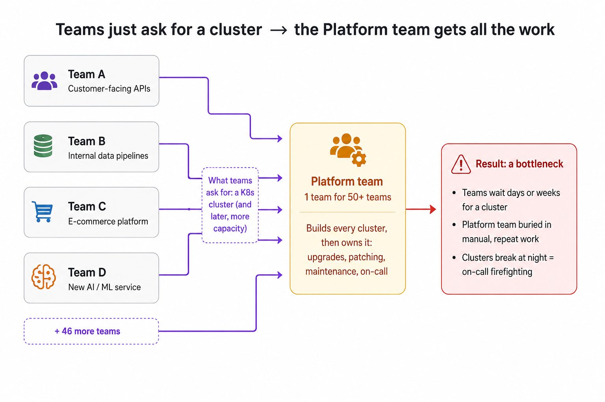

## Kubernetes Cluster Management at Scale with Gardener

### 1. The Scenario

Let's assume we have a large software company, more than 5,000+ employees, multiple products, customers all over the world.

This company has 50+ development teams. Each team owns different projects, different microservices, and has different needs:

- Team A builds customer-facing APIs that handle millions of requests per day

- Team B works on internal data pipelines that process terabytes of information

- Team C maintains the company's e-commerce platform

- Team D is building a new AI/ML service

And so on, and so on...

Every single team needs one thing in common: **a place to run their containers.**

#### 1.1. The Daily Conversation

Now, here's a conversation that happens every single day, multiple times a day, in this company:

**Developer:** "Hey Platform Team, we're spinning up a new service and we need a Kubernetes cluster."

**Platform Team:** "Sure, what do you need?"

**Developer:** "Nothing fancy:

- 3 worker nodes

- 8GB RAM and 4 vCPU per node

- Needs to auto-scale

- We don't care if it's AWS, Azure, or GCP, just give us something that works

- Oh, and when can we have it?"

**Platform Team:** (sighs internally) "We'll get back to you."

This exact conversation plays out multiple times a day, every single day of the year. And it's not just about creating clusters, it's about keeping them healthy, updating them, scaling them, and making sure they don't break at 2 AM.
